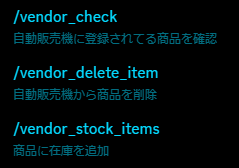

# Vendor-bot-document
Discordで使える自動販売機Botの説明書です  
PayPayアカウントをリンクさせて自動で残高を受け取ることができます  
説明にある通り無料で配布してるわけではないので、サーバー (https://discord.gg/aSyaAK7Ktm) かDiscordのDM (.taka.) にお願いします  
## 始める前に
### 必要なモジュール  
- discord.py
- requests
- PayPaython

すべて```pip install ○○```でインストールできます
### セットアップ
  
この2つを同一ディレクトリに置いたらvendor.pyを編集します  
#### vendor.py
```py
13行目：

TOKEN = 'MTE3NDIzMjQyOTAyMDU5ODM1Ng.~~~~~~~~'
datapath="C:/Users/Taka/Documents/mybot/vendor/"
```  
```TOKEN```にDiscord Botのトークンを、```datapath```にこのBotのデータを格納するディレクトリのパスを入力します  
入力が終わったら起動して、```/login_pay```でPayPayアカウントにログイン、```/tweak```でログを送信するチャンネルを設定します  
- ```/tweak```  
    
  ```ログチャンネル```で選択したチャンネルにログ (購入ログ、エラーログ) を送信します  
  管理者しかアクセスできないチャンネルを設定してください  
  ```実績チャンネル```で選択したチャンネルには実績 (簡易的な購入ログ) を送信します  
  このチャンネルは設定しなくても大丈夫です  
  ```なし```と入力すると設定をリセットできます  
## 在庫操作
- ```/create_vendor```で自動販売機を作成できます  
  名前にはファイル名として有効な文字を使用してください  
- ```/vendor_add_item```で商品と在庫を設定できます  
    
  在庫に限りがないもの (例えば特定のファイル、WebサイトのURLなど) は```在庫に限りがあるか```で```False```を選び、```中身```に中身を設定します  
  在庫に限りがあるもの (例えばメールアドレス / パスワードが一組になるSNSのアカウント、1回きりのギフトコードなど) はここで```在庫に限りがあるか```で```True```を選び、```中身```は設定しません  
- ```/vendor_stock_items```  
    
  在庫に限りがあるものの在庫を設定します  
  在庫追加はモーダルに書いてある通りですが (在庫ごとに改行して入力する)、在庫を入力せず商品名だけ入れた場合はその商品の在庫一覧を返します  
    
## コマンド一覧
  
  
  
ソースコードは630行  
  
## コンタクト
サーバー / https://discord.gg/aSyaAK7Ktm  
Discord / .taka.
